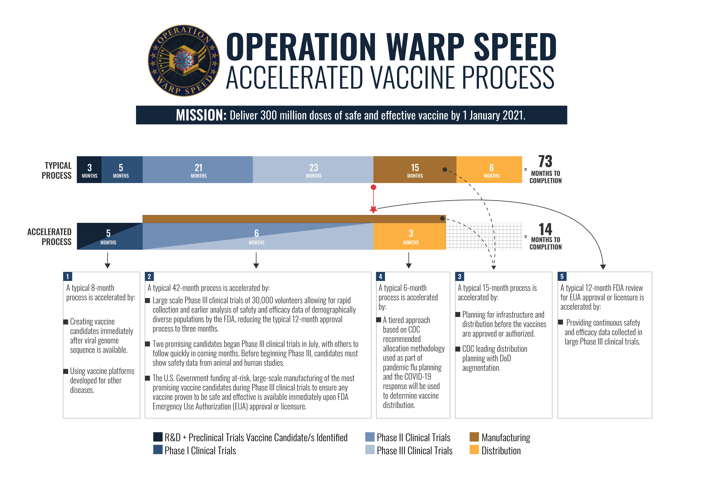
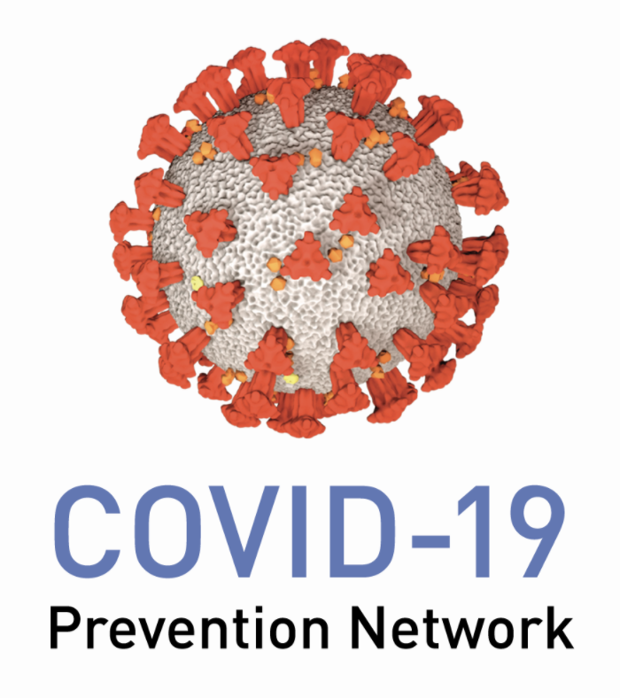
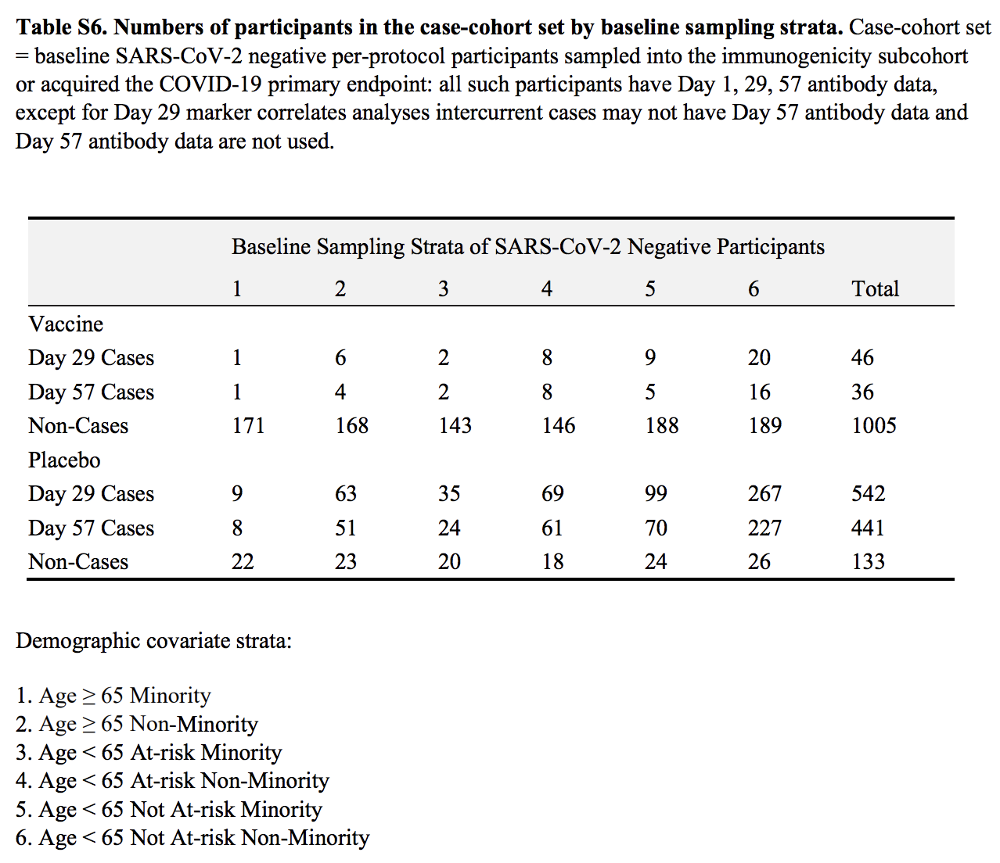
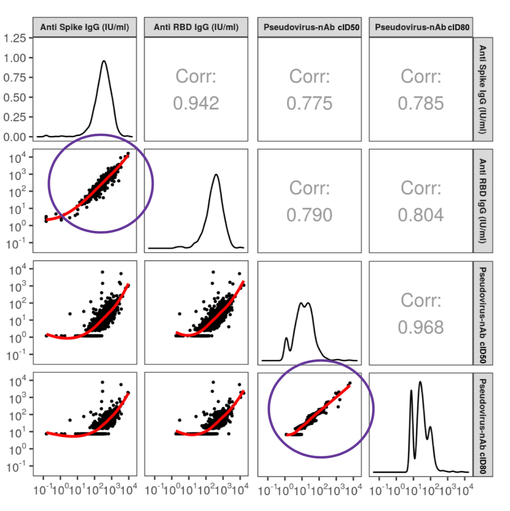
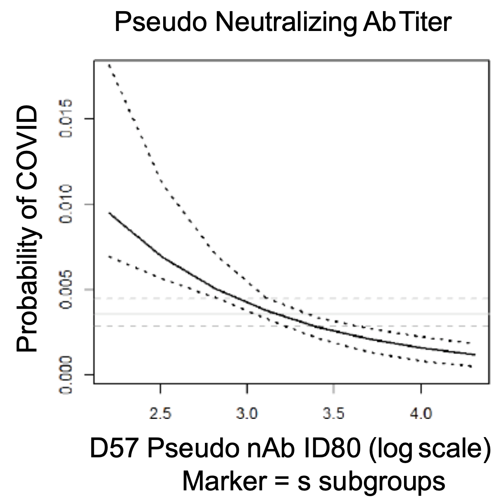
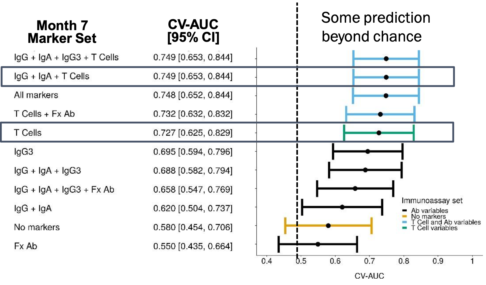
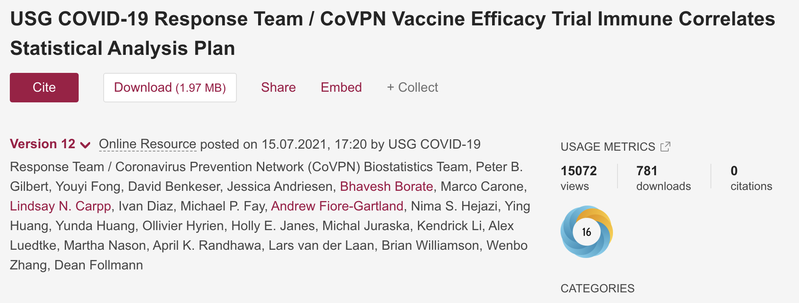
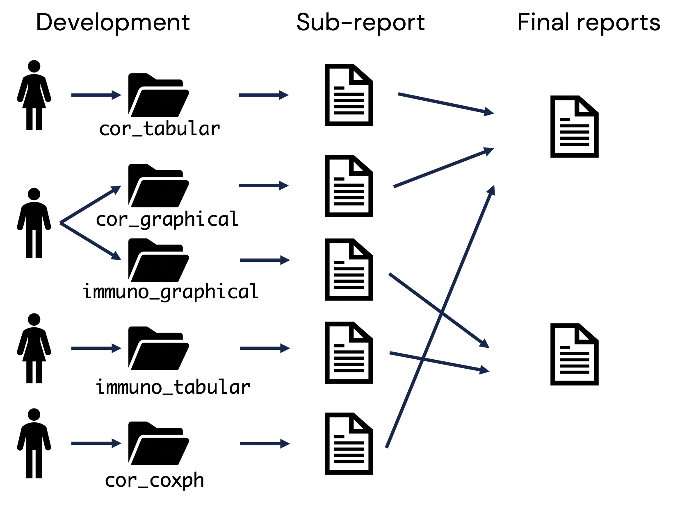

```{r xaringan-themer, include=FALSE, warning=FALSE}
library(xaringanthemer)

extra_css <- list(
  ".small" =  list(`font-size` = "80%"),
  ".tiny" =  list(`font-size` = "70%"),
  ".large" =  list(`font-size` = "150%"),
  ".huge" =  list(`font-size` = "300%"),
  "ul li" = list(`margin-bottom` = "10px"),
  ".gray" = list(color = "#C0C0C0"),
  ".red" = list(color = "#CE1141"),
  ".blue1" = list(color = "#3AABBE"),
  ".blue2" = list(color = "#2A6D90"),
  ".blue3" = list(color = "#446874"),
  ".purple" = list(color = "#624474"),
  ".mutedred" = list(color = "#745344"),
  "a" = list(color = "#E7A801"),
  "a:hover" = list("text-decoration" = "underline")
)

style_mono_accent(
  base_color = "#13274F",
  header_font_google = google_font("DM Sans"),
  text_font_google   = google_font("DM Sans", "400", "400i"),
  code_font_google   = google_font("Courier Prime"),
  extra_css = extra_css
)
```

<style type="text/css">
.remark-slide-content {
    font-size: 22px
}
</style>

## Acknowledgments

.pull-left[.tiny[
__Leadership__
* Peter Gilbert (FHCRC, UW)
* Youyi Fong (FHCRC)

__CoVPN Correlates Team__
* Chenchen Yu
* Yiwen Lu
* Ellis Hughes
* Lars van der Laan
* Kendrick Li
* Brian Simpkins
* Di Lu (BARDA)

]]

.pull-right[.tiny[
__Moderna Biostatistics__
* Weiping Deng
* Honghong Zhou
* Shu Han

__Government__
* Dean Follmann (NIAID)
* James Zhou (BARDA)

]
]

---

```{r, echo = FALSE, out.height="575px", fig.align="center"}

```

.small[from [DoD](https://www.defense.gov/Explore/Spotlight/Coronavirus/Operation-Warp-Speed/)]

???

Two main ways companies can interface with OWS: 
* purchasing/manufacturing funding
* OWS-run trials (agreements through BARDA @ NIH)

---

## COVID-19 Prevention Network

[CoVPN](https://www.coronaviruspreventionnetwork.org/) was [formed by NIAID](https://www.nih.gov/news-events/news-releases/nih-launches-clinical-trials-network-test-covid-19-vaccines-other-prevention-tools) to establish a unified clinical trial network for evaluating vaccines and monoclonal antibodies.

* pooling of resources across __four existing trials networks__
* clinical sites, laboratories, recruitment specialists, statisticians, ...

.pull-left[

```{r, echo = FALSE, out.height="250px", out.width="250px", fig.align="center"}

```

]

.pull-right[__Statisticians__ advise on: 

* primary trial __design and analysis__
* sequential __efficacy monitoring__
* __safety__ monitoring
* DSMB/FDA comments
* __immune correlates__

]

---

## Correlates of risk/protection

Two, interrelated goals of correlates analysis are to 

* identify/validate possible __surrogate endpoints__;
* understand __protective mechanisms__ of vaccines. 

If an __immune correlate__ is established to __reliably predict vaccine efficacy__, then subsequent efficacy trials may use the CoP as the __primary endpoint__. 

__Accelerates approval__ of

* existing vaccines in __different populations__ (e.g., children);
* __new vaccines__ in the same class.

---

## Immunogenicity

.pull-left[

```{r, immuno1, echo = FALSE, out.width = "300px", out.height = "300px", fig.align = "center"}

```

* Descriptive tables 
* E.g., sampling strata and cases

]

.pull-right[

```{r, immuno2, echo = FALSE, out.width = "300px", out.height = "300px", fig.align = "center"}

```

* Descriptive plots of marker distributions
* E.g., bivariate scatter plots

]


---

## Correlates of risk


.pull-left[

```{r, cor1, echo = FALSE, out.width = "250px", out.height = "250px", fig.align = "center"}

```

* Risk given immune response + baseline covariate adjustment
* E.g., Cox model

]

.pull-right[

```{r, cor2, echo = FALSE, out.width = "400px", out.height = "250px"}

```

* Machine learning prediction using different sets of immune responses.\*

]

<br> <br> 

.small[\* [Neidich et al (2019)](https://doi.org/10.1172/JCI126391)]

---

## Correlates considerations

From the outset, we knew that this science would be:

* __heavily scrutinized__

  * need for transparent, open science.

* __high impact__

  * need to "get it right"

* __reproduced for many trials__

  * five USG-funded trials + others

---

## Correlates challenges

From the outset, we recognized there would be challenges:

* .red[complex statistical methodology]

  * different analysts need to implement different analyses

* .red[difficult-to-reproduce methodology]

  * ensemble machine learning with cross-validation

* .red[regulatory compliant computing framework]

  * FDA interested in results

* .red[under extreme time pressure]

  * information needed ASAP to inform policy

---

## Correlates challenges

For Moderna, we also faced the key challenge that we had

.center[.huge[.red[No direct access to data!]]]

.center[.huge[😱]]

---

class: inverse, center, middle

.large[*We're not building the airplane while flying it; we're sewing the parachute while falling.*]

*Unknown, 2021*

---

## Open science

Early on, we posted a version-controlled SAP [online](https://figshare.com/articles/online_resource/CoVPN_COVID-19_Vaccine_Efficacy_Trial_Immune_Correlates_SAP/13198595).

.center[

```{r, sap, echo = FALSE, out.height = "150px", out.width = "400px"}

```

]

Open software development on GitHub.
* [CoVPN/correlates_reporting](https://github.com/CoVPN/correlates_reporting_usgcove_archive)
* 3,042 commits and counting... 😎

<br>

✅ need for transparent, open science

---

## Project organization

.center[.red[*File organization and naming are powerful weapons against chaos.*]]
.center[Jenny Bryan]

<br> 

.center[

```{r, orgo, echo = FALSE, out.height = "350px", out.width = "500px"}

```

]

---

## Project organization

Loose guidelines for __sub-directory structure__.

* consistency vs. expediency

Each sub-directory produces a __child R Markdown report__.

* `Makefile` used to document dependencies

Master `Makefile` and `bookdown` run analyses and __produce final reports__.

<br> 

✅ different analysts need to implement different analyses

✅ under extreme time pressure

---

## Code verification

.red[High importance results] underwent double programming.

* original programmer = generate specification document
* independent programmer = generate same results
* confirm identical results

[Ellis Hughes](https://twitter.com/ellis_hughes) was instrumental in this effort.

Double programming included __ensemble machine learning__ results!

✅ need to "get it right"

✅ difficult-to-reproduce methodology

---

## Remote computing

Approaches used to prepare for Moderna analysis:

* "Practice" data set for local development

  * Detailed specifications given to Moderna stats to align data formatting, definitions, etc...

* `R` package control using [`{renv}`](https://rstudio.github.io/renv/index.html)

  * 💯

* Continuous integration using [Travis CI](https://www.travis-ci.com/)
  
  * configure environment to be "Moderna"-like
  * automated report builds on practice data, pushed back to GitHub 

---

class: inverse, center, middle

.large[*You just need to type "make" and everything will build automatically!*]

*Me, a foolish optimist, early 2021*


---

class: inverse, middle

<blockquote class="twitter-tweet"><p lang="en" dir="ltr">Sure, being bitten by a thousand fire ants is bad, but have you tried debugging someone else’s code... over WebEx?!</p>&mdash; David Benkeser (@biosbenk) <a href="https://twitter.com/biosbenk/status/1387486297930018818?ref_src=twsrc%5Etfw">April 28, 2021</a></blockquote> <script async src="https://platform.twitter.com/widgets.js" charset="utf-8"></script>

.center[ *Me, more of a realist, April 2021*]

---

## Happy endings

After many hours, and with great patience from Weiping Deng, we were able to get the report to compile.

* 1129 pages in total 😦

A preprint is available on [medRxiv](https://www.medrxiv.org/content/10.1101/2021.08.09.21261290v1)

* doi: 10.1101/2021.08.09.21261290v1
* Currently under revision at *Science*


---

## Looking forward

❓❓ reproduced for many trials ❓❓

Code is being __generalized__ to adapt to additional trials

* A more [general correlates reporting](https://github.com/CoVPN/correlates_reporting2) process
* __Custom configurations__ depending on trial specifications

Analyses in the pipeline:

* HVTN 705 (HIV vaccine)
* Janssen (Johnson and Johnson) COVID
* AstraZeneca, SinoVac, CureVac, NovaVax, Sanofi-Pasteur

---

## Lessons learned

* Standardizing computing architectures is __relatively straightforward__. .red[Standardizing data formatting/processing is not].

* .red[Code defensively]: check for missing values, sanity check inputs, ...

* .red[Continuous integration] is your (best) friend as a code supervisor.

* Always a difficult tension between .red[speed vs. quality coding].

---

class: center, inverse
background-image: url("img/worldseries.jpeg")
background-position: center
background-size: cover

.huge[.white[Questions?]]